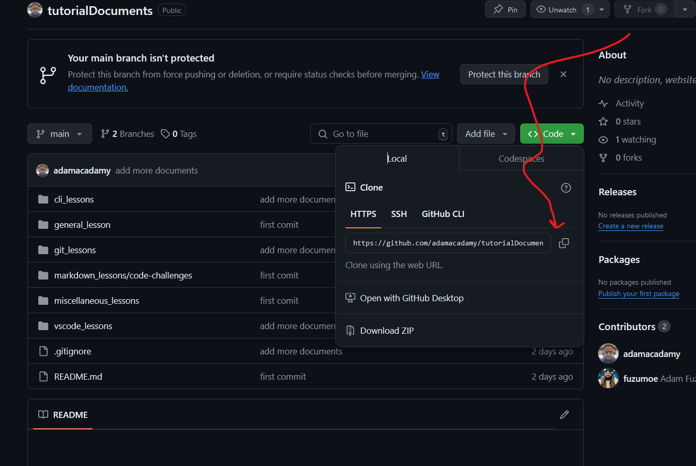

#   Creating a pull request

### What is a pull request?
A pull request (often referred to as “PR”) is a proposal to merge a set of changes from one branch into another. By creating a pull request, you can review a set of changes with others before they are incorporated into the main code base. Before getting to that, it’s helpful to define a couple of terms.

Source branch: the branch containing your changes.
Target branch: the branch you are trying to merge your changes into.
Pull requests provide a visual representation of the differences in the content between the source branch and the target branch. This is what enables you to review the changes before accepting them and pulling them into the target branch.

### Creating your pull request
On GitHub, navigate to your repository, clone it, and create a new branch. If you need a refresher for any of these steps, refer to the earlier GitHub for Beginners entries. For the purposes of this walkthrough, we created a new branch in our repository called update-name. After creating this branch, open your terminal and run git checkout -b update-name to navigate to the update-name branch.

Here is an example illustrating that
`tutorialDocuments` is the repo used for storing all the lessons and code chalets used for our bootp courses, for illustration we will clone this repo and create a merger request.

1. Open `Git Bash` and move to the desired repo cloning directory, for windows it is 
common practice to have projects located in 
the Documents directory

```bash
mkdir -p ~/Documents/myLessons
cd ~/Documents/myLessons
```
2. Navigate to [adam acadamy tutorials repo `https://github.com/adamacadamy/tutorialDocuments`](https://github.com/adamacadamy/tutorialDocuments) and clone the 
repository.

 
**N.B.**
YOUR_FULL_NAME => is your full name separated by underscore/snake case, ,** e.g.** ADAM FUZUM TEWELDE will be `adam_fuzum_tewelde` 

```bash
git clone https://github.com/adamacadamy/tutorialDocuments.git
git checkout -b <students_full_name>
git push --set-upstream origin <YOUR_FULL_NAME>
```

3. Create your bootcamp meta file in the repo

YOUR_FULL_NAME => is your full name separated by underscore/snake case, ,** e.g.** ADAM FUZUM TEWELDE will be `adam_fuzum_tewelde` 


```
mkdir -p students_meta/students_full_name
touch students_meta/<YOUR_FULL_NAME>/meta.txt
```

the contents of the `meta.txt` should be as follows
YOUR FULL NAME => your full name ** e.g.** `ADAM FUZUM TEWELDE`
YOUR FULL EMAIL => is your email **e.g.** `youremail@gmail.com`
GITHUB USER NAME => is your github account yousername **e.g.**  `adamacadamy`
```bash
name=<YOUR FULL NAME>
email=<YOUR FULL EMAIL>
github_user_name=<GITHUB USER NAME>
```

4. Stage, commit and push your changes
YOUR_FULL_NAME => is your full name separated by underscore/snake case, ,** e.g.** ADAM FUZUM TEWELDE will be `adam_fuzum_tewelde` 

```bash
git add students_meta/<YOUR_FULL_NAME>/meta.txt
git commit -m "add my students meta content"
git push
```
