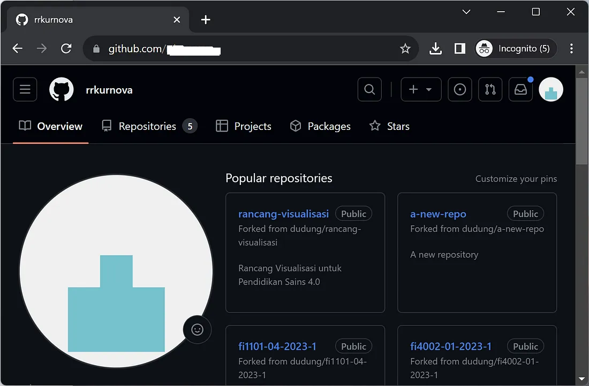
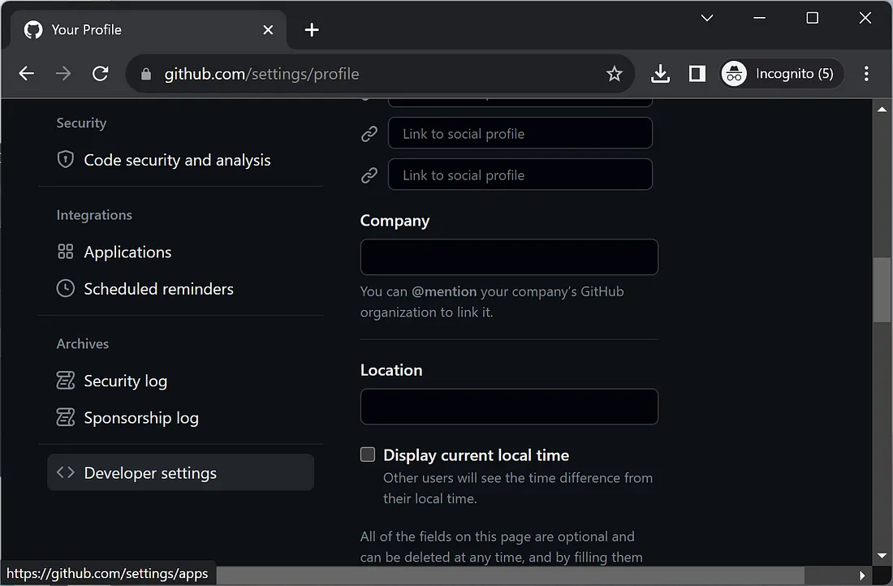

# GitHub personal access token
Steps to generate and use GitHub personal access token are given here in brief.
 
###  Generate
1. #### Go to your GitHub profile page, `https://github.com/<username>`.  


2. #### Click on the avatar icon on the top right corner.


3. #### Scroll down to have Developer settings on the left.


4. #### Click Developer settings


5. #### Expand Personal access tokens and choose Tokens (classic).


6. #### Click Generate new token button on the right.


7. ### Confirm access.


8. #### Fill Note field to remind you the purpose of this token, e.g. lecture-notes.


9. #### Click Generate token button.


10. #### CPersonal access token is created. Save it since it will not display again. Refresh the page.

 
11. #### Personal access token is created. Save it since it will not display again. Refresh the page.


12. #### To enable Git's credential store, run the following command in your terminal:

```bash
git config --global credential.helper store
```