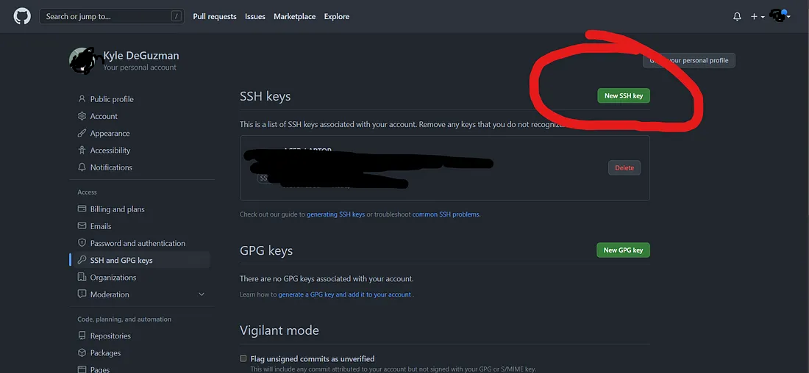
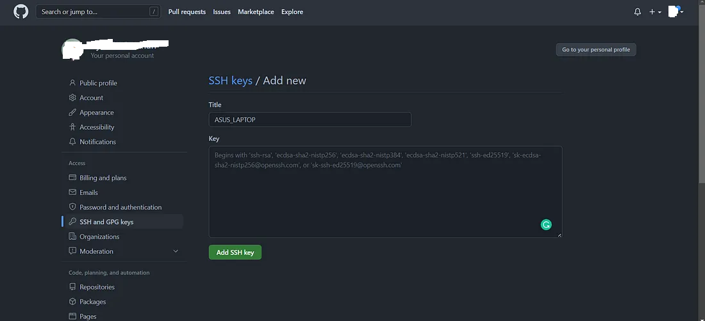

# Setting up SSH Key for GitHub

## 1. Check for Existing SSH Keys
Before creating a new SSH key, check if you already have one by running the following command in your terminal:

```bash
ls -al ~/.ssh
```

If you see files named `id_rsa` (private key) and `id_rsa.pub` (public key), you already have an SSH key. You can use this key or create a new one.

## 2. Generate a New SSH Key
If you don't have an SSH key or want to create a new one, generate one using the following command:

```bash
ssh-keygen -t ed25519 -C "your_email@example.com"
```

- Replace `"your_email@example.com"` with the email address associated with your GitHub account.
- When prompted, press `Enter` to accept the default location (`/home/your_user/.ssh/id_ed25519`).
- You can choose to set a passphrase for added security, or leave it empty for convenience.

If you're using an older system that doesn't support the `ed25519` algorithm, you can use RSA:

```bash
ssh-keygen -t rsa -b 4096 -C "your_email@example.com"
```

## 3. Add the SSH Key to the SSH Agent
To ensure that your SSH key is used automatically, you need to add it to the SSH agent:

1. Start the SSH agent:

   ```bash
   eval "$(ssh-agent -s)"
   ```

2. Add your SSH private key to the SSH agent:

   ```bash
   ssh-add ~/.ssh/id_ed25519
   ```

   (If you created an RSA key, use `~/.ssh/id_rsa` instead.)

## 4. Add the SSH Key to Your GitHub Account
Now, you need to add the SSH key to your GitHub account:

1. Copy your SSH public key to your clipboard:

   ```bash
   cat ~/.ssh/id_ed25519.pub
   ```

   (If you created an RSA key, use `~/.ssh/id_rsa.pub`.)

2. Log in to your GitHub account and navigate to **Settings**.
3. In the left sidebar, click on **SSH and GPG keys**.
4. Click **New SSH key**, then paste your public key into the key field.
5. Give your key a descriptive title, like "My Work Laptop" or "Personal MacBook".
6. Click **Add SSH key** to save the new key.

## 5. Test Your SSH Connection
To ensure that your SSH connection is set up correctly, run the following command:

```bash
ssh -T git@github.com
```

If everything is configured correctly, you'll see a message like:

```bash
Hi username! You've successfully authenticated, but GitHub does not provide shell access.
```

## 6. Use SSH with Git
Once your SSH key is added, you can clone repositories using the SSH URL. For example:

```bash
git clone git@github.com:username/repository.git
```

This setup allows you to authenticate to GitHub using SSH instead of HTTPS, avoiding the need to enter your username and password every time.

## 7. Configure SSH for GitHub (Optional)
If you have multiple SSH keys or want to customize your connection to GitHub, you can configure your `~/.ssh/config` file. This file allows you to define specific SSH settings for different hosts.

1. Open the `~/.ssh/config` file in a text editor. If the file doesn’t exist, you can create it:

   ```bash
   nano ~/.ssh/config
   ```

2. Add the following configuration for GitHub:

   ```bash
   Host github.com
     HostName github.com
     User git
     IdentityFile ~/.ssh/id_ed25519
   ```

   - Replace `~/.ssh/id_ed25519` with the path to your private key if you’re using a different key, such as `~/.ssh/id_rsa`.
   - If you have multiple GitHub accounts (e.g., personal and work), you can define multiple entries:

   ```bash
   Host github-personal
     HostName github.com
     User git
     IdentityFile ~/.ssh/id_ed25519_personal

   Host github-work
     HostName github.com
     User git
     IdentityFile ~/.ssh/id_ed25519_work
   ```

   In this case, you would use `git@github-personal:username/repository.git` or `git@github-work:username/repository.git` when cloning repositories.

3. Save and close the file.

This configuration ensures that the correct SSH key is used when connecting to GitHub and allows for easier management of multiple keys.

## 8 Add SSH key to github
1. #### Log Into GitHub and Go To Settings


2. #### Open the Tab “SSH and GFG Keys”


3. #### Create a “NEW SSH KEY”


4. #### The screen shown below will pop up.


Give your SSH key a meaningful title. I called mine ASUS LAPTOP.

Then paste in your SSH key. Hit the green button “Add SHH KEY”. GitHub will prompt you to enter your password to confirm it's really you. And after you confirm your password, you are set!

Now, you can remember that your SSH keys are always stored in your desktop. They’re in a folder called .ssh .

You’re done. Congratulations.


## Useful Resources
- [Git Credential Manager Documentation](https://aka.ms/gcm) 
- [GitHub: Creating a Personal Access Token](https://docs.github.com/en/github/authenticating-to-github/creating-a-personal-access-token)
- [Git Documentation: Credential Storage](https://git-scm.com/book/en/v2/Git-Tools-Credential-Storage)
 