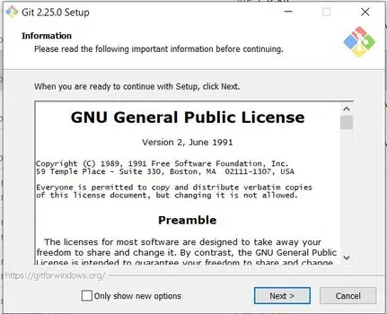

## How to Install Git Bash?

Follow the steps given below to install ****Git Bash on Windows****:

****Step 1:**** The .exe file installer for Git Bash can be downloaded from “****https://gitforwindows.org/”**** Once downloaded execute that installer, following window will occur.

Git Bash Installation

****Step 2:**** Select the components that you need to install and click on the Next button.

.webp)

Install Git Bash

****Step 3:**** Select the path where you want to ****install git**** as shown in the image below.

.webp)

Install Git Bash

****Step 4:**** Let the installation process finish to begin using Git Bash. To open ****Git Bash**** navigate to the folder where you have installed the git otherwise just simply search in your OS for git bash.

.webp)

 