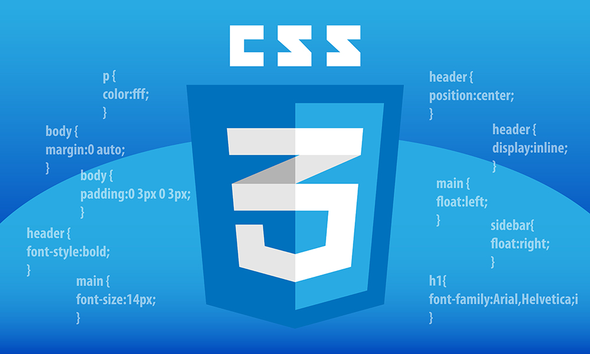

# CSS Basics

## What is CSS?

**CSS (Cascading Style Sheets)** is a style sheet language used to describe the look and formatting of a document written in HTML. It controls the layout of multiple web pages all at once, making your website consistent and easy to maintain.

CSS allows you to control the colors, fonts, spacing, and overall layout of a webpage, separating content (HTML) from presentation (CSS).

## CSS Syntax

A CSS rule is made up of three parts: a **selector**, a **property**, and a **value**.

```css
selector {
  property: value;
}
```

- **Selector**: Specifies which HTML element the styles will apply to (e.g., `p` for paragraphs).
- **Property**: The style attribute you want to change (e.g., `color`, `font-size`).
- **Value**: The setting for the property (e.g., `red`, `16px`).

### Example:

```css
p {
  color: blue;
  font-size: 16px;
}
```

This CSS rule changes all `<p>` elements to have blue text and a font size of 16 pixels.

## How to Apply CSS

### 1. Inline CSS

You can apply CSS directly to an HTML element using the `style` attribute:

```html
<p style="color: red;">This is a red paragraph.</p>
```

### 2. Internal CSS

You can define CSS rules within the `<style>` tag inside the HTML document's `<head>` section:

```html
<head>
  <style>
    p {
      color: green;
    }
  </style>
</head>
```

### 3. External CSS

The most common way to apply CSS is by linking an external CSS file to your HTML document using the `<link>` tag in the `<head>` section:

```html
<head>
  <link rel="stylesheet" href="styles.css">
</head>
```

Then, you write your CSS rules in the external `styles.css` file.

## CSS Selectors

CSS selectors allow you to target specific HTML elements to apply styles.

### Basic Selectors:

- **Type Selector**: Selects all elements of a specific type.

  ```css
  p {
    color: blue;
  }
  ```

- **Class Selector**: Selects elements with a specific class. Classes are defined in HTML with the `class` attribute and selected in CSS with a `.` before the class name.

  ```css
  .example-class {
    color: red;
  }
  ```

  ```html
  <p class="example-class">This is red text.</p>
  ```

- **ID Selector**: Selects an element with a specific ID. IDs are defined in HTML with the `id` attribute and selected in CSS with a `#` before the ID name.

  ```css
  #example-id {
    color: green;
  }
  ```

  ```html
  <p id="example-id">This is green text.</p>
  ```

- **Universal Selector**: Selects all elements.

  ```css
  * {
    margin: 0;
    padding: 0;
  }
  ```

### Grouping Selectors:

You can group multiple selectors that share the same styles:

```css
h1, h2, h3 {
  color: purple;
}
```

### Descendant Selector:

You can target an element that is inside another element:

```css
div p {
  color: orange;
}
```

This targets all `<p>` elements inside a `<div>`.

## CSS Box Model


Every HTML element is a rectangular box, and CSS uses the **box model** to determine the size, padding, border, and margin of that box. Understanding the box model is crucial for layout design.

- **Content**: The actual content of the element (e.g., text, image).
- **Padding**: Space between the content and the border.
- **Border**: A line surrounding the padding (if any) and content.
- **Margin**: Space outside the border, separating the element from other elements.

### Example:

```css
div {
  width: 200px;
  padding: 10px;
  border: 2px solid black;
  margin: 20px;
}
```

This example creates a `div` with a content width of 200px, 10px padding, a 2px black border, and a 20px margin around it.

## CSS Layout

CSS provides several properties to control the layout of elements on the page.

### Display

The `display` property specifies how an element is displayed.

- **block**: The element takes up the full width available (e.g., `div`, `p`).
- **inline**: The element takes up only as much width as it needs (e.g., `span`, `a`).
- **inline-block**: Like `inline`, but allows setting width and height.

```css
div {
  display: block;
}

span {
  display: inline-block;
  width: 100px;
  height: 50px;
}
```

### Positioning

The `position` property specifies the positioning of an element.

- **static**: The default position; elements are placed in the normal document flow.
- **relative**: Positioned relative to its normal position.
- **absolute**: Positioned relative to the nearest positioned ancestor.
- **fixed**: Positioned relative to the browser window.
- **sticky**: A hybrid of relative and fixed positioning.

### Example:

```css
div {
  position: relative;
  top: 10px;
  left: 20px;
}
```

This moves the `div` 10px down and 20px right from its normal position.

### Flexbox

Flexbox is a powerful layout tool that makes it easier to design flexible and responsive layouts.

- **flex-container**: The parent element that holds the items.
- **flex-items**: The child elements inside the container.

Example:

```css
.container {
  display: flex;
  justify-content: space-between;
}

.item {
  width: 100px;
  height: 100px;
}
```

This creates a flex container with items spaced evenly within the container.

## CSS Colors

CSS provides several ways to define colors:

- **Color Names**: `red`, `blue`, `green`
- **Hex Codes**: `#ff0000`, `#00ff00`, `#0000ff`
- **RGB**: `rgb(255, 0, 0)`, `rgb(0, 255, 0)`, `rgb(0, 0, 255)`
- **RGBA**: Same as RGB, but with an alpha channel for transparency, e.g., `rgba(255, 0, 0, 0.5)`
- **HSL**: Hue, Saturation, Lightness, e.g., `hsl(120, 100%, 50%)`

Example:

```css
p {
  color: #ff6347; /* Tomato color */
  background-color: rgb(240, 248, 255); /* AliceBlue background */
}
```

## Fonts and Text Styling

CSS allows you to control the appearance of text, including fonts, size, style, and alignment.

### Font Family

The `font-family` property specifies the font of the text. You can specify multiple fonts as a fallback list:

```css
body {
  font-family: Arial, sans-serif;
}
```

### Font Size

The `font-size` property defines the size of the text:

```css
h1 {
  font-size: 24px;
}
```

### Font Style

The `font-style` property can be used to make text italic:

```css
em {
  font-style: italic;
}
```

### Text Alignment

The `text-align` property is used to align text horizontally:

```css
p {
  text-align: center;
}
```

### Text Decoration

The `text-decoration` property is often used to add or remove underlines:

```css
a {
  text-decoration: none;
}
```

## Conclusion

This tutorial covered the basics of CSS, including syntax, selectors, layout, colors, and fonts. CSS is a powerful tool for making your web pages look visually appealing and responsive across different devices. As you continue to learn, you’ll explore advanced topics like CSS Grid, transitions, animations, and media queries for responsive design.

Happy styling!
