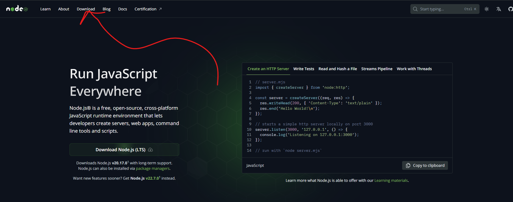
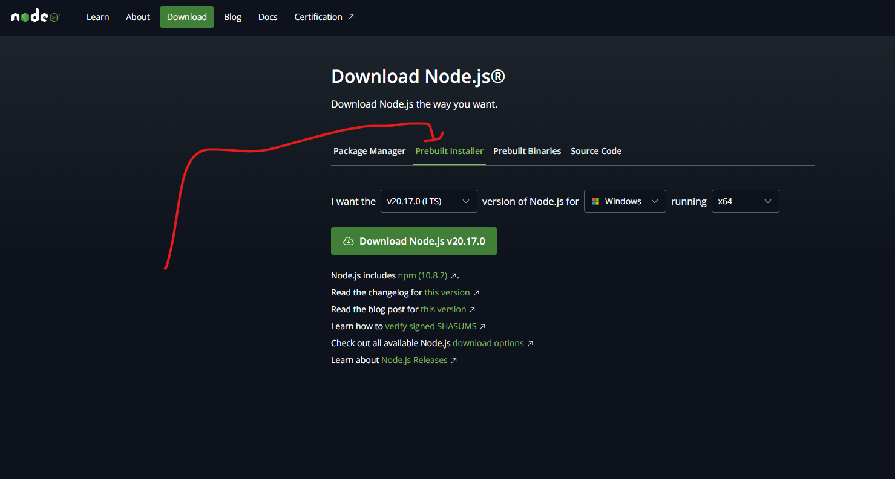
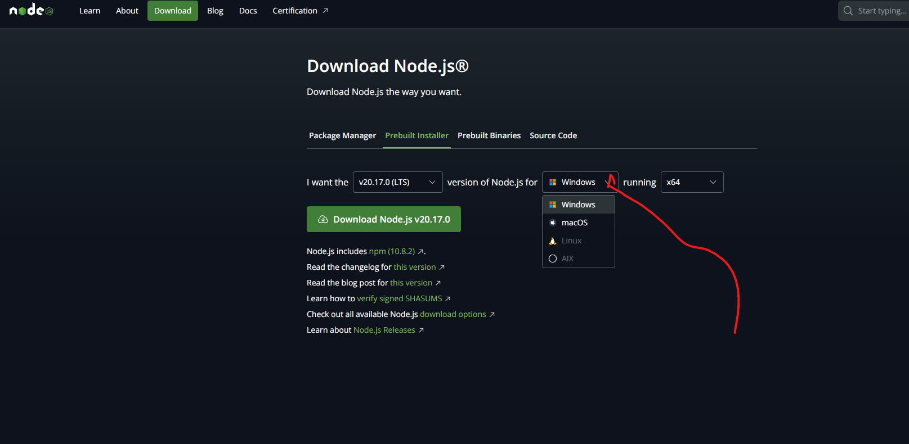
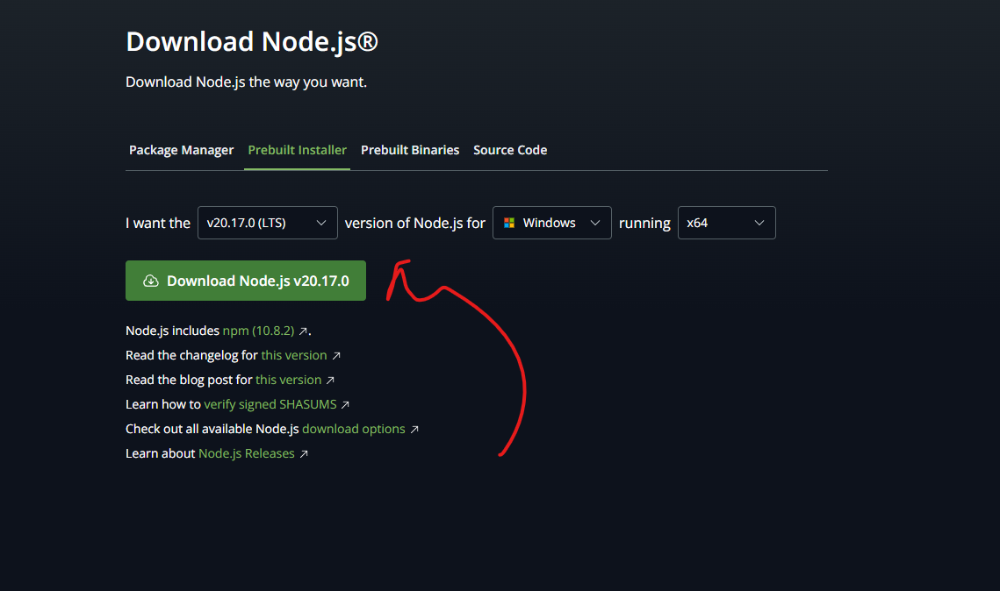
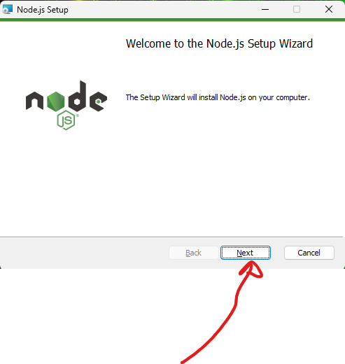
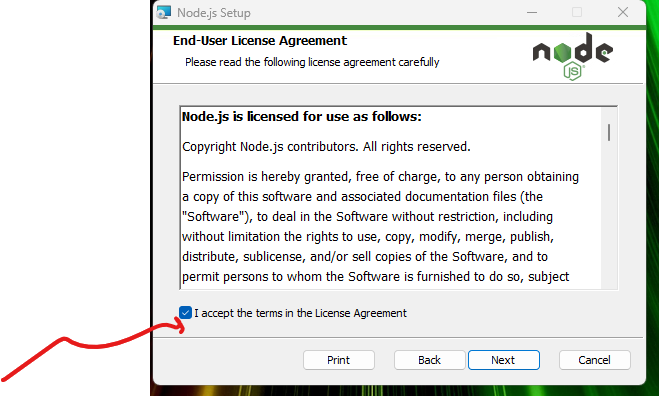
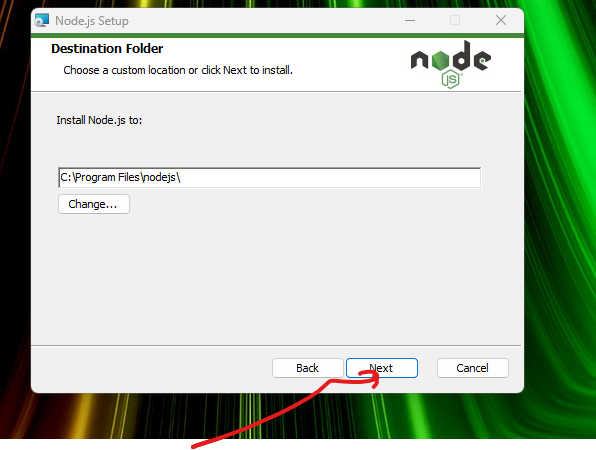
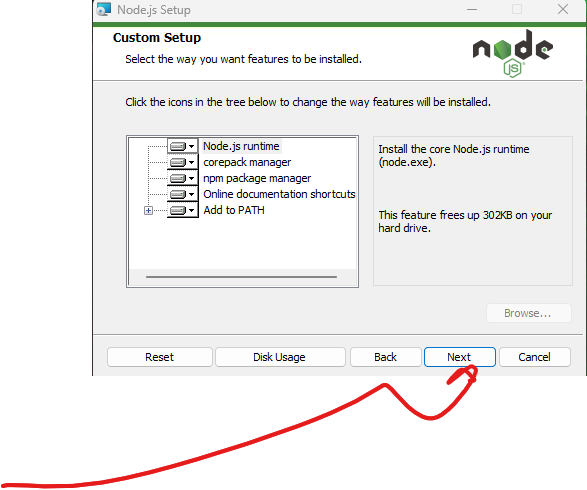
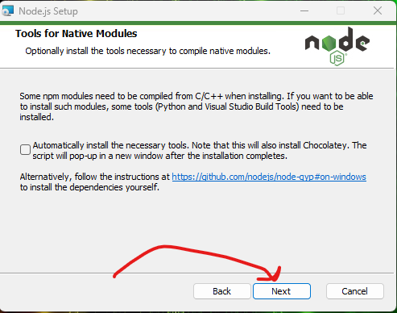
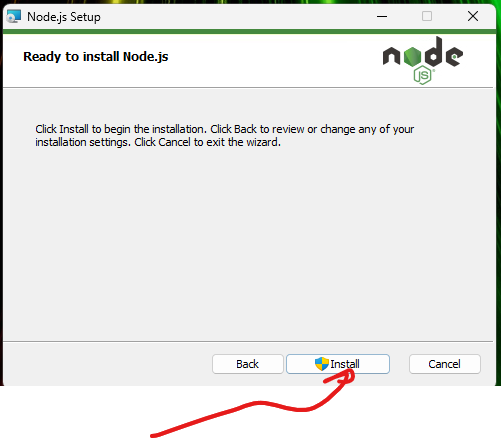

### Node.js Installation on Windows Step-by-Step

1. Go to Node.js official website. -> https://nodejs.org/en click Click the “Download” button on the Homepage.

2. click on the `Prebuilt installer` tab
   

3. select your `os` version 

4. finally click `Download Node.js vs...`
   

5. go to downloads directory and start the install process and then click the `next` button.

5. check the `I accept terms in the License Agreement` 
   

6. click the `next` button and proceed with the install

7. click the `next` button and proceed with the install
 

8. click the `next` button and proceed with the install

9. finally click `install` 
