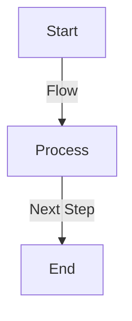
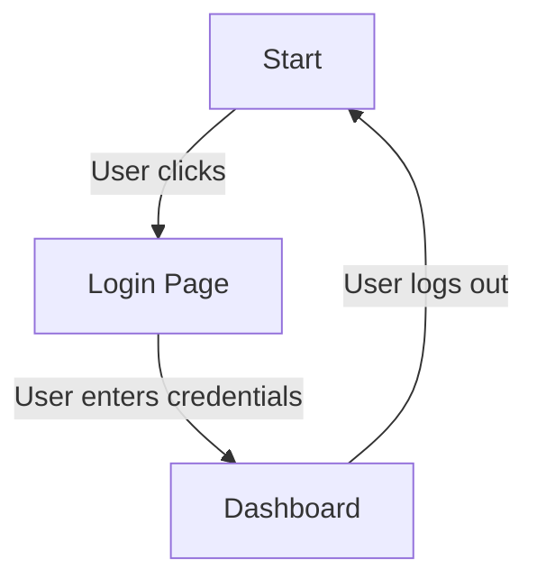
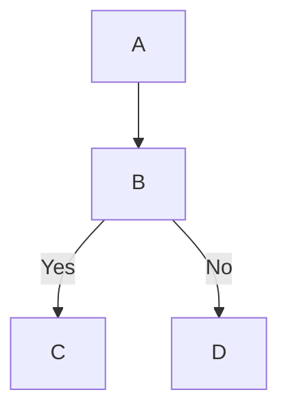
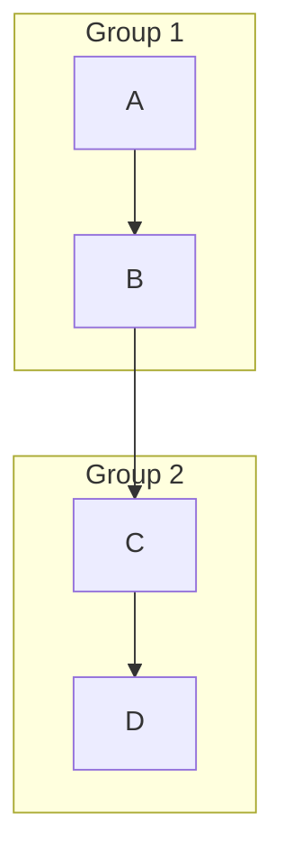
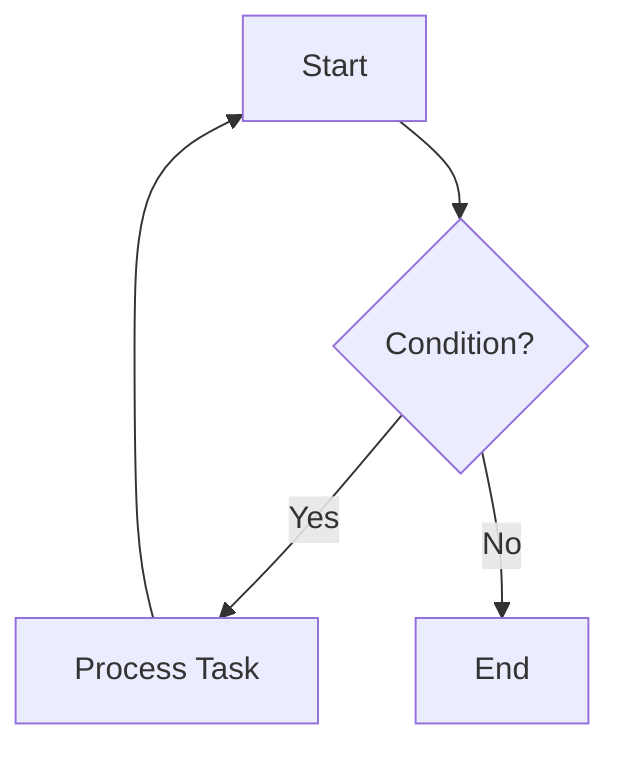

# Mermaid.js Flowchart Tutorial for Markdown

## Integrating Mermaid with VS Code

To enable Mermaid diagrams in VS Code, follow these steps:

1. **Install the Mermaid Markdown Extension**

   - Open VS Code.
   - Go to the Extensions Marketplace (`Ctrl+Shift+X`).
   - Search for `Markdown Preview Mermaid Support` and install it.

2. **Enable Mermaid Preview**

   - Open a Markdown file (`.md`).
   - Use the **command palette** (`Ctrl+Shift+P`) and select `Markdown: Open Preview to the Side`.
   - Ensure the extension is activated to render Mermaid diagrams correctly.

3. **Alternative: Use Live Preview Extensions**

   - Extensions like `Markdown Preview Enhanced` also support Mermaid.
   - Install `Markdown Preview Enhanced` from the VS Code marketplace.
   - Open a Markdown file and toggle live preview to view Mermaid flowcharts in real-time.

## Introduction

Mermaid.js allows users to create flowcharts using a simple text-based syntax. These flowcharts can be embedded in Markdown documents to visually represent workflows, decision trees, and processes.

## How to Use Mermaid for Flowcharts in Markdown

To use Mermaid flowcharts in Markdown, wrap your Mermaid syntax inside triple backticks (` ``` `) and specify `mermaid` as the language.

### Example Structure:

```text
graph TD;
    A[Start] -->|Flow| B[Process];
    B -->|Next Step| C[End];
```


This will render as:
```text

graph TD;
    A[Start] -->|Flow| B[Process];
    B -->|Next Step| C[End];
```


## Flowchart Components

### 1. Nodes (Shapes)

Nodes represent different elements in the flowchart.

#### Example:  



### 2. Arrows (Connections)

Arrows define the flow between nodes.

#### Example:

```text
graph TD;
    A --> B;
    B -- Yes --> C;
    B -- No --> D;
```  



### 3. Labels on Arrows

Arrows can have labels to describe transitions.

#### Example:


### 4. Subgraphs (Grouping)

Subgraphs help organize related nodes.

#### Example:

```text
graph TD;
    subgraph Group 1
        A --> B;
    end
    subgraph Group 2
        C --> D;
    end
    B --> C;
```



### 5. Loops and Decisions

You can create loops and condition-based flows using decisions.

#### Example:

```text
graph TD;
    A[Start] --> B{Condition?};
    B -- Yes --> C[Process Task];
    C --> A;
    B -- No --> D[End];
```



## Where to Use Mermaid Flowcharts

- **GitHub/GitLab** (via Markdown support)
- **Markdown Renderers that Support Mermaid**
- **Jupyter Notebooks (with Mermaid extensions)**

## Tips & Tricks

- **Use `%%` for comments** inside Mermaid diagrams.
- **Keep your flowcharts simple and readable** by breaking down complex processes.
- **Test your flowcharts using [Mermaid Live Editor](https://mermaid-js.github.io/mermaid-live-editor/)**.