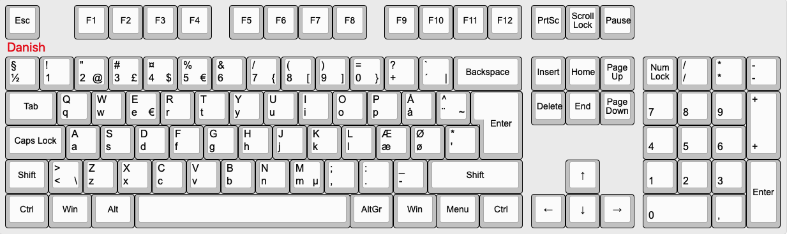

# Danish Keyboard Symbols Keymap (QWERTY)
!
## Special Danish Characters
| Symbol | Key Combination          | Notes                             |
|--------|--------------------------|-----------------------------------|
| `æ`    | `æ` (Key next to 'ø')     | Danish letter AE ligature         |
| `Æ`    | `Shift + æ`               | Capital AE ligature               |
| `ø`    | `ø` (Key next to 'l')     | Danish letter O with stroke       |
| `Ø`    | `Shift + ø`               | Capital O with stroke             |
| `å`    | `å` (Key next to 'p')     | Danish letter A with ring         |
| `Å`    | `Shift + å`               | Capital A with ring               |

## Numbers and Basic Symbols
| Symbol | Key Combination          | Notes                             |
|--------|--------------------------|-----------------------------------|
| `1`    | `Shift + 1`              | Number 1 / Exclamation mark       |
| `!`    | `Shift + 1`              | Exclamation mark                  |
| `2`    | `Shift + 2`              | Number 2 / Quotation mark         |
| `"`    | `Shift + 2`              | Double quotation mark             |
| `3`    | `Shift + 3`              | Number 3 / Number sign            |
| `#`    | `Shift + 3`              | Number sign (Hash)                |
| `4`    | `Shift + 4`              | Number 4 / Dollar sign            |
| `$`    | `Shift + 4`              | Dollar sign                       |
| `5`    | `Shift + 5`              | Number 5 / Percent sign           |
| `%`    | `Shift + 5`              | Percent sign                      |
| `6`    | `Shift + 6`              | Number 6 / Ampersand              |
| `&`    | `Shift + 6`              | Ampersand                         |
| `7`    | `Shift + 7`              | Number 7 / Forward slash          |
| `/`    | `Shift + 7`              | Forward slash                     |
| `8`    | `Shift + 8`              | Number 8 / Open parenthesis       |
| `(`    | `Shift + 8`              | Open parenthesis                  |
| `9`    | `Shift + 9`              | Number 9 / Close parenthesis      |
| `)`    | `Shift + 9`              | Close parenthesis                 |
| `0`    | `Shift + 0`              | Number 0 / Equals sign            |
| `=`    | `Shift + 0`              | Equals sign                       |
| `+`    | `+`                      | Plus sign                         |
| `?`    | `Shift + -`              | Question mark                     |
| `´`    | `´` (Key next to `å`)     | Acute accent (Dead key)           |
| `¨`    | `Shift + `´``            | Diaeresis (Dead key)              |

## Punctuation and Mathematical Symbols
| Symbol | Key Combination          | Notes                             |
|--------|--------------------------|-----------------------------------|
| `-`    | `-`                      | Hyphen or Minus sign              |
| `_`    | `Shift + -`              | Underscore                        |
| `=`    | `Shift + 0`              | Equals sign                       |
| `+`    | `+`                      | Plus sign                         |
| `[`    | `Alt Gr + 8`             | Open square bracket               |
| `{`    | `Alt Gr + 7`             | Open brace                        |
| `]`    | `Alt Gr + 9`             | Close square bracket              |
| `}`    | `Alt Gr + 0`             | Close brace                       |
| `\`    | `Alt Gr + `´``            | Backslash                         |
| `|`    | `Alt Gr + <`             | Vertical bar                      |
| `;`    | `;`                      | Semicolon                         |
| `:`    | `Shift + ;`              | Colon                             |
| `'`    | `'`                      | Single quote                      |
| `"`    | `Shift + 2`              | Double quote                      |
| `,`    | `,`                      | Comma                             |
| `<`    | `Shift + ,`              | Less than sign                    |
| `.`    | `.`                      | Period (Dot)                      |
| `>`    | `Shift + .`              | Greater than sign                 |
| `/`    | `/`                      | Forward slash                     |
| `?`    | `Shift + /`              | Question mark                     |

## Special Symbols
| Symbol | Key Combination          | Notes                             |
|--------|--------------------------|-----------------------------------|
| `@`    | `Alt Gr + 2`             | At sign                           |
| `€`    | `Alt Gr + E`             | Euro sign                         |
| `~`    | `Alt Gr + +`             | Tilde                             |
| `^`    | `Shift + `¨``             | Caret                             |
| `` ` ``| `` ` ``                  | Backtick (Grave accent)           |

## Windows Alt Codes for Special Characters (Using Numpad)
| Symbol | Alt Code                 | Notes                             |
|--------|--------------------------|-----------------------------------|
| `©`    | `Alt + 0169`             | Copyright symbol                  |
| `®`    | `Alt + 0174`             | Registered trademark symbol       |
| `™`    | `Alt + 0153`             | Trademark symbol                  |
| `µ`    | `Alt + 0181`             | Micro sign                        |
| `£`    | `Alt + 0163`             | British Pound sign                |
| `¥`    | `Alt + 0165`             | Yen sign                          |
| `€`    | `Alt + 0128`             | Euro sign                         |
| `¬`    | `Alt + 0172`             | Not sign                          |

**Note:** The `Alt Gr` key on Danish keyboards is essential for accessing special characters like the at sign (`@`) and the Euro symbol (`€`). Additionally, dead keys like `´` and `¨` are used for typing accented characters. Windows Alt codes are also provided for more special characters.
