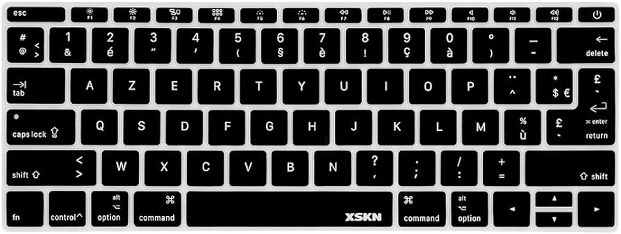

# French Keyboard Symbols Keymap (AZERTY)
!
## Special French Characters
| Symbol | Key Combination          | Notes                             |
|--------|--------------------------|-----------------------------------|
| `é`    | `é` (Key next to '2')     | Lowercase E with acute accent     |
| `è`    | `è` (Key next to '9')     | Lowercase E with grave accent     |
| `ê`    | `^ + e`                  | Lowercase E with circumflex       |
| `à`    | `à` (Key next to '0')     | Lowercase A with grave accent     |
| `ç`    | `ç` (Key next to '9')     | Lowercase C with cedilla          |
| `ù`    | `ù` (Key next to '0')     | Lowercase U with grave accent     |

## Numbers and Basic Symbols
| Symbol | Key Combination          | Notes                             |
|--------|--------------------------|-----------------------------------|
| `1`    | `Shift + &`              | Number 1 / Ampersand              |
| `&`    | `&`                      | Ampersand                         |
| `2`    | `Shift + é`              | Number 2 / E with acute accent    |
| `é`    | `é`                      | E with acute accent               |
| `3`    | `Shift + "`              | Number 3 / Double quotation mark  |
| `"`    | `Shift + 3`              | Double quotation mark             |
| `4`    | `Shift + '`              | Number 4 / Single quotation mark  |
| `'`    | `Shift + 4`              | Single quotation mark             |
| `5`    | `Shift + (`              | Number 5 / Open parenthesis       |
| `(`    | `Shift + 5`              | Open parenthesis                  |
| `6`    | `Shift + -`              | Number 6 / Dash                   |
| `-`    | `Shift + 6`              | Dash                              |
| `7`    | `Shift + è`              | Number 7 / E with grave accent    |
| `è`    | `è`                      | E with grave accent               |
| `8`    | `Shift + _`              | Number 8 / Underscore             |
| `_`    | `Shift + 8`              | Underscore                        |
| `9`    | `Shift + ç`              | Number 9 / C with cedilla         |
| `ç`    | `ç`                      | C with cedilla                    |
| `0`    | `Shift + à`              | Number 0 / A with grave accent    |
| `à`    | `à`                      | A with grave accent               |

## Punctuation and Mathematical Symbols
| Symbol | Key Combination          | Notes                             |
|--------|--------------------------|-----------------------------------|
| `-`    | `-`                      | Hyphen or Minus sign              |
| `_`    | `Shift + 8`              | Underscore                        |
| `=`    | `Shift + à`              | Equals sign                       |
| `+`    | `Shift + +`              | Plus sign                         |
| `[`    | `Alt Gr + (`              | Open square bracket               |
| `{`    | `Alt Gr + 4`              | Open brace                        |
| `]`    | `Alt Gr + )`              | Close square bracket              |
| `}`    | `Alt Gr + 5`              | Close brace                       |
| `\`    | `Alt Gr + \`              | Backslash                         |
| `|`    | `Alt Gr + |`              | Vertical bar                      |
| `;`    | `;`                      | Semicolon                         |
| `:`    | `Shift + .`              | Colon                             |
| `'`    | `'`                      | Single quote                      |
| `"`    | `Shift + 3`              | Double quote                      |
| `,`    | `,`                      | Comma                             |
| `<`    | `Shift + ,`              | Less than sign                    |
| `.`    | `.`                      | Period (Dot)                      |
| `>`    | `Shift + .`              | Greater than sign                 |
| `/`    | `/`                      | Forward slash                     |
| `?`    | `Shift + ,`              | Question mark                     |

## Special Symbols
| Symbol | Key Combination          | Notes                             |
|--------|--------------------------|-----------------------------------|
| `@`    | `Alt Gr + 0`             | At sign                           |
| `€`    | `Alt Gr + e`             | Euro sign                         |
| `~`    | `Alt Gr + é`             | Tilde                             |
| `^`    | `Shift + ^`              | Caret                             |
| `§`    | `Alt Gr + s`             | Section sign                      |
| `#`    | `Alt Gr + 3`             | Hash (Pound)                      |

## Windows Alt Codes for Special Characters (Using Numpad)
| Symbol | Alt Code                 | Notes                             |
|--------|--------------------------|-----------------------------------|
| `©`    | `Alt + 0169`             | Copyright symbol                  |
| `®`    | `Alt + 0174`             | Registered trademark symbol       |
| `™`    | `Alt + 0153`             | Trademark symbol                  |
| `µ`    | `Alt + 0181`             | Micro sign                        |
| `£`    | `Alt + 0163`             | British Pound sign                |
| `¥`    | `Alt + 0165`             | Yen sign                          |
| `€`    | `Alt + 0128`             | Euro sign                         |
| `¬`    | `Alt + 0172`             | Not sign                          |

**Note:** The `Alt Gr` key on French keyboards is used to access many special characters such as the at sign (`@`) and the Euro symbol (`€`). Additionally, some symbols require combinations of the `Alt Gr` key and other keys. Windows Alt codes are also provided for additional special characters.
