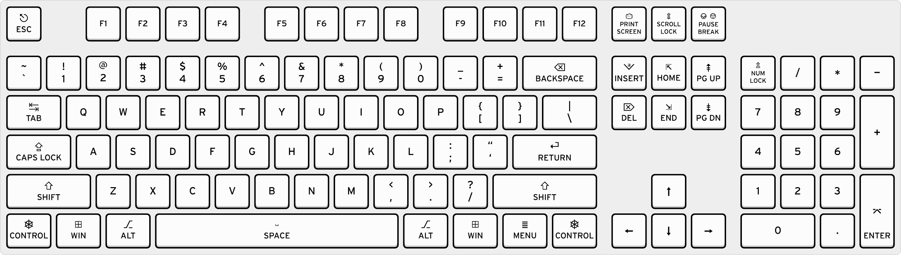

# Keyboard Symbols Keymap
!
## Numbers and Basic Symbols
| Symbol | Key Combination        | Notes                          |
|--------|------------------------|--------------------------------|
| `1`    | `Shift + 1`            | Number 1 / Exclamation mark    |
| `!`    | `Shift + 1`            | Exclamation mark               |
| `2`    | `Shift + 2`            | Number 2 / At sign             |
| `@`    | `Shift + 2`            | At sign                        |
| `3`    | `Shift + 3`            | Number 3 / Hash (Pound)        |
| `#`    | `Shift + 3`            | Hash (Pound)                   |
| `4`    | `Shift + 4`            | Number 4 / Dollar sign         |
| `$`    | `Shift + 4`            | Dollar sign                    |
| `5`    | `Shift + 5`            | Number 5 / Percent sign        |
| `%`    | `Shift + 5`            | Percent sign                   |
| `6`    | `Shift + 6`            | Number 6 / Caret               |
| `^`    | `Shift + 6`            | Caret                          |
| `7`    | `Shift + 7`            | Number 7 / Ampersand           |
| `&`    | `Shift + 7`            | Ampersand                      |
| `8`    | `Shift + 8`            | Number 8 / Asterisk            |
| `*`    | `Shift + 8`            | Asterisk                       |
| `9`    | `Shift + 9`            | Number 9 / Open parenthesis    |
| `(`    | `Shift + 9`            | Open parenthesis               |
| `0`    | `Shift + 0`            | Number 0 / Close parenthesis   |
| `)`    | `Shift + 0`            | Close parenthesis              |

## Punctuation and Mathematical Symbols
| Symbol | Key Combination        | Notes                          |
|--------|------------------------|--------------------------------|
| `-`    | `-` (minus key)         | Hyphen or Minus sign           |
| `_`    | `Shift + -`             | Underscore                     |
| `=`    | `=`                    | Equals sign                    |
| `+`    | `Shift + =`             | Plus sign                      |
| `[`    | `[`                    | Open bracket                   |
| `{`    | `Shift + [`             | Open brace                     |
| `]`    | `]`                    | Close bracket                  |
| `}`    | `Shift + ]`             | Close brace                    |
| `\`    | `\`                    | Backslash                      |
| `|`    | `Shift + \`             | Vertical bar                   |
| `;`    | `;`                    | Semicolon                      |
| `:`    | `Shift + ;`             | Colon                          |
| `'`    | `'`                    | Single quote                   |
| `"`    | `Shift + '`             | Double quote                   |
| `,`    | `,`                    | Comma                          |
| `<`    | `Shift + ,`             | Less than sign                 |
| `.`    | `.`                    | Period (Dot)                   |
| `>`    | `Shift + .`             | Greater than sign              |
| `/`    | `/`                    | Forward slash                  |
| `?`    | `Shift + /`             | Question mark                  |

## Special Symbols
| Symbol | Key Combination        | Notes                          |
|--------|------------------------|--------------------------------|
| `~`    | `Shift + \``            | Tilde                          |
| `` ` ``| `` ` ``                 | Backtick (Grave accent)        |
| `§`    | `Alt + 0167`            | Section sign (Windows)         |
| `¶`    | `Alt + 0182`            | Pilcrow (Windows)              |
| `©`    | `Alt + 0169`            | Copyright sign (Windows)       |
| `®`    | `Alt + 0174`            | Registered sign (Windows)      |
| `™`    | `Alt + 0153`            | Trademark sign (Windows)       |

## Arrows and Other Special Characters (Windows)
| Symbol | Key Combination        | Notes                          |
|--------|------------------------|--------------------------------|
| `↑`    | `Alt + 24`             | Up arrow                      |
| `↓`    | `Alt + 25`             | Down arrow                    |
| `→`    | `Alt + 26`             | Right arrow                   |
| `←`    | `Alt + 27`             | Left arrow                    |

**Note:** Some symbols, such as mathematical symbols and special characters, require specific key combinations or are available via the Alt + number method on Windows. Mac users often use Option (⌥) or Option + Shift combinations for similar symbols.

## Windows Alt Codes for Special Characters

| Symbol | Alt Code     | Notes                                   |
|--------|--------------|-----------------------------------------|
| `©`    | `Alt + 0169` | Copyright symbol                        |
| `®`    | `Alt + 0174` | Registered trademark symbol             |
| `™`    | `Alt + 0153` | Trademark symbol                        |
| `µ`    | `Alt + 0181` | Micro sign                              |
| `£`    | `Alt + 0163` | British Pound sign                      |
| `¥`    | `Alt + 0165` | Yen sign                                |
| `€`    | `Alt + 0128` | Euro sign                               |
| `¬`    | `Alt + 0172` | Not sign                                |

This list includes common symbols that can be typed using a keyboard. Depending on your operating system and keyboard layout, additional symbols may be accessible using different key combinations.
