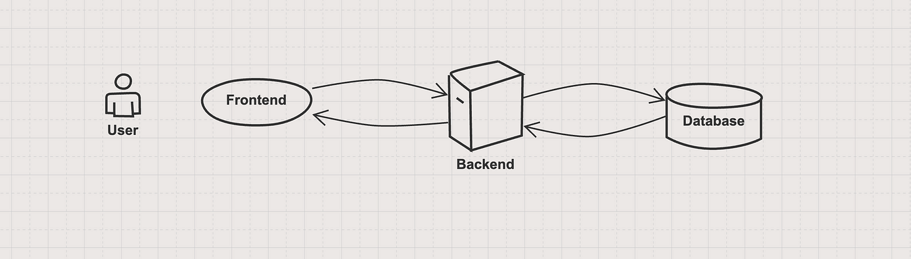

# **REST API Guide**

---

## **1. General Application Infrastructure Setup**

### **Application Architecture**

1. **Frontend Tier (Client-Side)**
   - The user interface (UI) where users interact with the system.
   - Examples: A web app (React, Angular), a mobile app, or a CLI.
   - Sends HTTP requests to the backend to perform CRUD operations.

2. **Backend Tier (Server-Side)**
   - The logic layer that processes requests from the frontend.
   - Provides REST API endpoints for CRUD operations.
   - Implements authentication, validation, and business rules.
   - Examples: Flask, FastAPI, Express.js, Django.

3. **Data Tier (Database Layer)**
   - The storage layer for persisting application data.
   - Can be relational (MySQL, PostgreSQL) or NoSQL (MongoDB, DynamoDB).

---

### **Infrastructure Components**
- **Load Balancer**: Distributes incoming traffic across multiple backend servers for scalability.
- **Web Server**: Handles HTTP requests (e.g., Nginx, Apache).
- **Application Server**: Hosts the backend application and serves REST APIs.
- **Database**: Stores structured or unstructured data.

---

## **2. HTTP Communication**

### **What is HTTP Protocol?**
HTTP (Hypertext Transfer Protocol) is the foundation of data communication on the World Wide Web. It facilitates communication between a client and a server. 

#### **Key Characteristics:**
- **Request-Response Model**: The client sends a request, and the server responds with data or status information.
- **Stateless**: Each request is treated independently, without retaining session state.
- **Secure Version (HTTPS)**: Adds encryption for secure communication using SSL/TLS.

---

### **HTTP Requests**

#### **Request Object**
An HTTP request contains:
- **Method**: The action to perform (e.g., `GET`, `POST`, `PUT`, `DELETE`).
- **URL**: Specifies the resource to interact with.
- **Headers**: Provide metadata about the request.
- **Body (Optional)**: Contains data to send to the server.

**Example Request:**
```http
POST http://127.0.0.1:8000/projects HTTP/1.1
Host: 127.0.0.1:8000
Content-Type: application/json
Authorization: Bearer <token>

{
    "name": "Project Alpha",
    "description": "A project for developing a web application."
}
```

---

### **HTTP Responses**

#### **Response Object**
An HTTP response contains:
- **Status Code**: Indicates the result of the request.
- **Headers**: Provide metadata about the response.
- **Body (Optional)**: Contains the response data.

**Example Response:**
```http
HTTP/1.1 201 Created
Content-Type: application/json

{
    "success": true,
    "message": "Project created successfully.",
    "data": {
        "id": 1,
        "name": "Project Alpha",
        "description": "A project for developing a web application.",
        "created_at": "2024-12-01T10:00:00Z"
    }
}
```

---

### **Key Components of HTTP Communication**

#### **1. HTTP Methods**
| Method   | Description                   | Example                              |
|----------|-------------------------------|--------------------------------------|
| **GET**  | Retrieve resources            | `GET http://127.0.0.1:8000/projects`|
| **POST** | Create a new resource         | `POST http://127.0.0.1:8000/tasks`  |
| **PUT**  | Update an existing resource   | `PUT http://127.0.0.1:8000/tasks/101`|
| **DELETE** | Remove a resource           | `DELETE http://127.0.0.1:8000/tasks/101`|

#### **2. HTTP Headers**
Headers provide metadata for requests and responses.

**Request Headers Example:**
```http
Content-Type: application/json
Authorization: Bearer <token>
```

**Response Headers Example:**
```http
Content-Type: application/json
Cache-Control: no-cache
```

#### **3. Status Codes**
| Status Code | Name                  | Description                                  |
|-------------|-----------------------|----------------------------------------------|
| **200 OK**  | Request succeeded.    | Resource retrieved successfully.            |
| **201 Created** | Resource created. | A new resource was created on the server.    |
| **400 Bad Request** | Invalid input.| The request could not be processed.          |
| **404 Not Found** | Resource missing.| The requested resource does not exist.       |

---

## **3. Data Tier: Populated Tables**

### **Projects Table**
| ID  | Name            | Description                              | Created At         |
|-----|-----------------|------------------------------------------|--------------------|
| 1   | Project Alpha   | A project for developing a web application. | 2024-12-01T10:00:00Z |
| 2   | Project Beta    | A mobile app development project.        | 2024-12-02T11:00:00Z |

### **Tasks Table**
| ID  | Title                 | Description                                     | Due Date    | Status       | Project ID |
|-----|-----------------------|-------------------------------------------------|-------------|--------------|------------|
| 101 | Design homepage       | Create wireframes and mockups for the homepage. | 2024-12-10  | In Progress  | 1          |
| 102 | Setup CI/CD pipeline  | Configure continuous integration and deployment.| 2024-12-15  | Not Started  | 2          |

### **Users Table**
| ID  | Name            | Email                      | Assigned Tasks |
|-----|-----------------|----------------------------|----------------|
| 201 | Alice Johnson   | alice.johnson@example.com  | 101            |
| 202 | Bob Smith       | bob.smith@example.com      | 101            |
| 203 | Charlie Davis   | charlie.davis@example.com  | 102            |

### **Comments Table**
| ID  | Task ID | User ID | Text                                  | Created At         |
|-----|---------|---------|---------------------------------------|--------------------|
| 301 | 101     | 201     | Started working on wireframes.        | 2024-12-03T09:15:00Z |
| 302 | 101     | 202     | Reviewed the mockups, looks good.     | 2024-12-04T14:30:00Z |

---

## **4. REST API Workflows**

### **Create a New Project**

**Request:**
```http
POST http://127.0.0.1:8000/projects HTTP/1.1
Host: 127.0.0.1:8000
Content-Type: application/json
Authorization: Bearer <token>

{
    "name": "Project Alpha",
    "description": "A project for developing a web application."
}
```

**Response:**
```http
HTTP/1.1 201 Created
Content-Type: application/json

{
    "success": true,
    "message": "Project created successfully.",
    "data": {
        "id": 1,
        "name": "Project Alpha",
        "description": "A project for developing a web application.",
        "created_at": "2024-12-01T10:00:00Z"
    }
}
```

### **Fetch All Projects**

**Request:**
```http
GET http://127.0.0.1:8000/projects HTTP/1.1
Host: 127.0.0.1:8000
Authorization: Bearer <token>
```

**Response:**
```http
HTTP/1.1 200 OK
Content-Type: application/json

[
    {
        "id": 1,
        "name": "Project Alpha",
        "description": "A project for developing a web application.",
        "created_at": "2024-12-01T10:00:00Z"
    },
    {
        "id": 2,
        "name": "Project Beta",
        "description": "A mobile app development project.",
        "created_at": "2024-12-02T11:00:00Z"
    }
]
```

---
