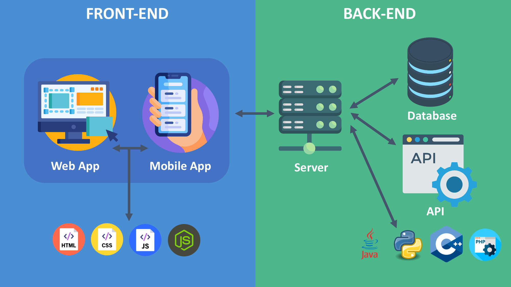

# **REST API Guide**

---

## **1. General Application Infrastructure Setup**

### **Application Architecture**
 

1. **Presentation Tier (Client-Side)**
   - The user interface (UI) where users interact with the system.
   - Examples: A web app (React, Angular), a mobile app, or a CLI.
   - Sends HTTP requests to the backend to perform CRUD operations.

2. **Business Tier (Server-Side)**
   - The logic layer that processes requests from the frontend.
   - Provides REST API endpoints for CRUD operations.
   - Implements authentication, validation, and business rules.
   - Examples: Flask, FastAPI, Express.js, Django.

3. **Data Tier (Database Layer)**
   - The storage layer for persisting application data.
   - Can be relational (MySQL, PostgreSQL) or NoSQL (MongoDB, DynamoDB).

---

### **Infrastructure Components**
- **Load Balancer**: Distributes incoming traffic across multiple backend servers for scalability.
- **Web Server**: Handles HTTP requests (e.g., Nginx, Apache).
- **Application Server**: Hosts the backend application and serves REST APIs.
- **Database**: Stores structured or unstructured data.

---

## **2. HTTP Communication**

### **What is HTTP Protocol?**
HTTP (Hypertext Transfer Protocol) is the foundation of data communication on the World Wide Web. It facilitates communication between a client and a server. 

#### **Key Characteristics:**
- **Request-Response Model**: The client sends a request, and the server responds with data or status information.
- **Stateless**: Each request is treated independently, without retaining session state.
- **Secure Version (HTTPS)**: Adds encryption for secure communication using SSL/TLS.

---

### **HTTP Requests**

#### **Request Object**
An HTTP request contains:
- **Method**: The action to perform (e.g., `GET`, `POST`, `PUT`, `DELETE`).
- **URL**: Specifies the resource to interact with.
- **Headers**: Provide metadata about the request.
- **Body (Optional)**: Contains data to send to the server.

**Example Request:**
```http
POST http://127.0.0.1:8000/projects HTTP/1.1
Host: 127.0.0.1:8000
Content-Type: application/json
Authorization: Bearer <token>

{
    "name": "Project Alpha",
    "description": "A project for developing a web application."
}
```

---

### **HTTP Responses**

#### **Response Object**
An HTTP response contains:
- **Status Code**: Indicates the result of the request.
- **Headers**: Provide metadata about the response.
- **Body (Optional)**: Contains the response data.

**Example Response:**
```http
HTTP/1.1 201 Created
Content-Type: application/json

{
    "success": true,
    "message": "Project created successfully.",
    "data": {
        "id": 1,
        "name": "Project Alpha",
        "description": "A project for developing a web application.",
        "created_at": "2024-12-01T10:00:00Z"
    }
}
```

---

### **Key Components of HTTP Communication**

#### **1. HTTP Methods**
| Method   | Description                   | Example                              |
|----------|-------------------------------|--------------------------------------|
| **GET**  | Retrieve resources            | `GET http://127.0.0.1:8000/projects`|
| **POST** | Create a new resource         | `POST http://127.0.0.1:8000/tasks`  |
| **PUT**  | Update an existing resource   | `PUT http://127.0.0.1:8000/tasks/101`|
| **DELETE** | Remove a resource           | `DELETE http://127.0.0.1:8000/tasks/101`|

#### **2. HTTP Headers**
Headers provide metadata for requests and responses.

**Request Headers Example:**
```http
Content-Type: application/json
Authorization: Bearer <token>
```

**Response Headers Example:**
```http
Content-Type: application/json
Cache-Control: no-cache
```

#### **3. Status Codes**

# HTTP Status Codes

| Code | Name                                   | Description                                   |
|------|----------------------------------------|-----------------------------------------------|
| **1xx Informational**                        |                                              |                                               |
| 100  | Continue                              | Request received, please continue.            |
| 101  | Switching Protocols                   | Switching to new protocol; obey Upgrade header.|
| 102  | Processing                            | WebDAV: Processing request.                   |
| 103  | Early Hints                           | Preload resources while server processes.     |
| **2xx Success**                              |                                              |                                               |
| 200  | OK                                    | Standard response for successful requests.    |
| 201  | Created                               | Request successful and a resource was created.|
| 202  | Accepted                              | Request accepted, processing pending.         |
| 203  | Non-Authoritative Information         | Returned meta-information not from origin.    |
| 204  | No Content                            | Request successful, but no content returned.  |
| 205  | Reset Content                         | Reset the document view.                      |
| 206  | Partial Content                       | Partial GET request fulfilled.                |
| 207  | Multi-Status                          | WebDAV: Multiple status for multiresource.    |
| 208  | Already Reported                      | WebDAV: Already reported in `207 Multi-Status`.|
| 226  | IM Used                               | Server has completed GET with instance manipulations.|
| **3xx Redirection**                          |                                              |                                               |
| 300  | Multiple Choices                      | Multiple options for the resource.            |
| 301  | Moved Permanently                     | Resource has been moved permanently.          |
| 302  | Found                                 | Resource temporarily resides at another URI.  |
| 303  | See Other                             | Redirect for resource found at another URI.   |
| 304  | Not Modified                          | Resource not modified since last request.     |
| 305  | Use Proxy                             | Resource must be accessed through a proxy.    |
| 307  | Temporary Redirect                    | Temporary redirect with unchanged method.     |
| 308  | Permanent Redirect                    | Permanent redirect with unchanged method.     |
| **4xx Client Error**                         |                                              |                                               |
| 400  | Bad Request                           | The request cannot be fulfilled due to bad syntax.|
| 401  | Unauthorized                          | Authentication is required.                   |
| 402  | Payment Required                      | Reserved for future use.                      |
| 403  | Forbidden                             | Server refuses to fulfill request.            |
| 404  | Not Found                             | Requested resource could not be found.        |
| 405  | Method Not Allowed                    | Method not allowed on the resource.           |
| 406  | Not Acceptable                        | Content characteristics unacceptable.         |
| 407  | Proxy Authentication Required         | Authentication required for proxy.            |
| 408  | Request Timeout                       | Request timed out.                            |
| 409  | Conflict                              | Request conflicts with the current state.     |
| 410  | Gone                                  | Resource is no longer available.              |
| 411  | Length Required                       | `Content-Length` header field is required.    |
| 412  | Precondition Failed                   | Server does not meet request preconditions.   |
| 413  | Payload Too Large                     | Payload is too large to process.              |
| 414  | URI Too Long                          | URI is too long to process.                   |
| 415  | Unsupported Media Type                | Media type not supported.                     |
| 416  | Range Not Satisfiable                 | Cannot fulfill the range specified.           |
| 417  | Expectation Failed                    | Expectation in the `Expect` header not met.   |
| 418  | I'm a Teapot                          | April Fools' joke from the RFC 2324.          |
| 421  | Misdirected Request                   | Request was directed incorrectly.             |
| 422  | Unprocessable Entity                  | WebDAV: Request semantic errors.              |
| 423  | Locked                                | WebDAV: Resource is locked.                   |
| 424  | Failed Dependency                     | WebDAV: Dependency failed.                    |
| 425  | Too Early                             | Risk of replay attack.                        |
| 426  | Upgrade Required                      | Client should switch to a different protocol. |
| 428  | Precondition Required                 | Request must meet preconditions.              |
| 429  | Too Many Requests                     | Client sent too many requests in a timeframe. |
| 431  | Request Header Fields Too Large       | Header fields too large.                      |
| 451  | Unavailable For Legal Reasons         | Resource is restricted for legal reasons.     |
| **5xx Server Error**                         |                                              |                                               |
| 500  | Internal Server Error                 | Generic server error message.                 |
| 501  | Not Implemented                       | Server does not support functionality.        |
| 502  | Bad Gateway                           | Invalid response from upstream server.        |
| 503  | Service Unavailable                   | Server unavailable due to maintenance or overload.|
| 504  | Gateway Timeout                       | Upstream server failed to respond.            |
| 505  | HTTP Version Not Supported            | HTTP version not supported.                   |
| 506  | Variant Also Negotiates               | Transparent content negotiation failure.       |
| 507  | Insufficient Storage                  | WebDAV: Server cannot store the representation.|
| 508  | Loop Detected                         | WebDAV: Infinite loop detected.               |
| 510  | Not Extended                          | Further extensions to the request are required.|
| 511  | Network Authentication Required       | Client must authenticate to gain network access.|


---

## **3. Data Tier: Populated Tables**

### **Projects Table**
| ID  | Name            | Description                              | Created At         |
|-----|-----------------|------------------------------------------|--------------------|
| 1   | Project Alpha   | A project for developing a web application. | 2024-12-01T10:00:00Z |
| 2   | Project Beta    | A mobile app development project.        | 2024-12-02T11:00:00Z |

### **Tasks Table**
| ID  | Title                 | Description                                     | Due Date    | Status       | Project ID |
|-----|-----------------------|-------------------------------------------------|-------------|--------------|------------|
| 101 | Design homepage       | Create wireframes and mockups for the homepage. | 2024-12-10  | In Progress  | 1          |
| 102 | Setup CI/CD pipeline  | Configure continuous integration and deployment.| 2024-12-15  | Not Started  | 2          |

### **Users Table**
| ID  | Name            | Email                      | Assigned Tasks |
|-----|-----------------|----------------------------|----------------|
| 201 | Alice Johnson   | alice.johnson@example.com  | 101            |
| 202 | Bob Smith       | bob.smith@example.com      | 101            |
| 203 | Charlie Davis   | charlie.davis@example.com  | 102            |

### **Comments Table**
| ID  | Task ID | User ID | Text                                  | Created At         |
|-----|---------|---------|---------------------------------------|--------------------|
| 301 | 101     | 201     | Started working on wireframes.        | 2024-12-03T09:15:00Z |
| 302 | 101     | 202     | Reviewed the mockups, looks good.     | 2024-12-04T14:30:00Z |

---

## **4. REST API Workflows**

### **Create a New Project**

**Request:**
```http
POST http://127.0.0.1:8000/projects HTTP/1.1
Host: 127.0.0.1:8000
Content-Type: application/json
Authorization: Bearer <token>

{
    "name": "Project Alpha",
    "description": "A project for developing a web application."
}
```

**Response:**
```http
HTTP/1.1 201 Created
Content-Type: application/json

{
    "success": true,
    "message": "Project created successfully.",
    "data": {
        "id": 1,
        "name": "Project Alpha",
        "description": "A project for developing a web application.",
        "created_at": "2024-12-01T10:00:00Z"
    }
}
```

### **Fetch All Projects**

**Request:**
```http
GET http://127.0.0.1:8000/projects HTTP/1.1
Host: 127.0.0.1:8000
Authorization: Bearer <token>
```

**Response:**
```http
HTTP/1.1 200 OK
Content-Type: application/json

[
    {
        "id": 1,
        "name": "Project Alpha",
        "description": "A project for developing a web application.",
        "created_at": "2024-12-01T10:00:00Z"
    },
    {
        "id": 2,
        "name": "Project Beta",
        "description": "A mobile app development project.",
        "created_at": "2024-12-02T11:00:00Z"
    }
]
```

---
