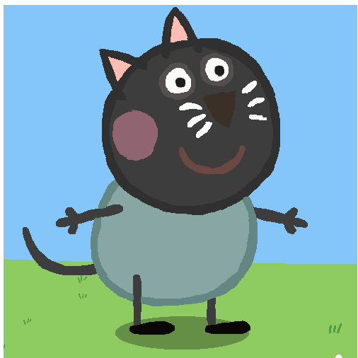

## IN CLASS EXERCISE

### Introduction
Welcome to the story of **Codey the Cat** [codey](https://www.google.com/url?sa=i&url=https%3A%2F%2Fwarriorcats.com%2Fcontent%2Fimage%2Fcody_6658065714429&psig=AOvVaw1fHIS3QSIOghOCczABD_5x&ust=1725704283064000&source=images&cd=vfe&opi=89978449&ved=0CBQQjRxqFwoTCLiPg9CLrogDFQAAAAAdAAAAABAE) is no ordinary cat-he's tech-savvy feline
who loves coding, solving problems, and exploring the digital world.

#### A Day in the Life of Codey

##### Morning Routine

Every morning, Codey follows a strict routine to keep his mind sharp and his paws nimble:

1.**Wake Up**: Codey wakes up at 7:00 AM sharp.
2.**Breakfast**: A hearty bowl of milk at 7:30 AM.
3:**Coding Session**: Form 8: AM to 10:00 Am, dives into code.
4.**Explore**: At 10:00 AM, he explores the digital garden.
5.**Lunch Break**: At12:00 PM, Codey enjoys a well-deserved meal. 
Here's what codey's daily schedule looks like:

Here's what Codey's daily schedule looks like:

| **Time** |        **Activity**        |
|----------|----------------------------|
| 7:00 AM  | Wake up and stretch        |
| 7:30 AM  | Breakfast                  |
| 8:00 Am  | Morning coding session     |
| 10:00Am  | Explore the digital garden |
| 12:00Am  | Lunch break                |

#### Codey's Coding Challenge

one day, while exploring the digital garden, Codey encoountered a locked gate. To unlock it,he needed to write a special function. Codey's process was simple but effective:

. **Identify the Problem**: The gate required a secret code to unlock.
. **Write the Function**: Codey quickly wrote a Python function.
.**Test the Code**: He tested the code with the correct 
secret key.

Here's the code Codey wrote:

def unlock_gate(secret_code):
 <!-- # The correct secret code -->
 key = "MEOW123"

 if secret_code == key:
 print("Gate unlock! Welcome to the digital garde, Codey!")
else:
print("Access denied. Try again, Codey!")

<!--  # codey tries the code -->
unlock_gate("MEOW123")

