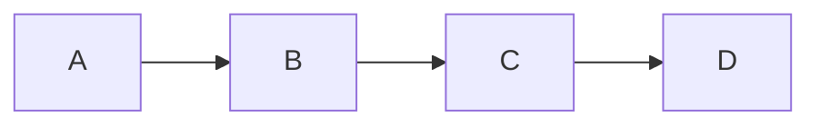

## How to be a good programmer
 ### Contents

[Learn the Basics](Learn-the-Basics)
[Practice Regurarly](Practice-Regurarly)
[Write clearn code](Write-clean-code)
[Use version Control](Use-Version)
[Stay curious](Stay-Curious)
[Communicate Well](Communicate-Well)

> How to Be a Good Programmer
To become a good programmer, follow these simple steps:

1. **Learn the Basics**
Understand core concepts like *data structures, algorithms, and problem-solving*.

2. **Practice Regularly**
The more you code, the better you get. Build projects, solve coding challenges, ~~and learn from your mistakes~~.

3. **Write Clean Code**
Make your code easy to read and maintain by using clear names, proper formatting, and comments when needed.

4. **Use Version Control**
Learn tools like Git to track changes and collaborate with others.

5. **Stay Curious**
Keep learning new technologies and improving your skills as programming evolves quickly.

6. **Communicate Well**
Work well with others by explaining ideas clearly and listening to feedback.
```

By doing these things consistently, you'll become a strong and effective programmer.

```


When Grace Hopper, a pioneer in computer science, was working on the first computer, the Mark I, she encountered an unexpected problem: the machine wasn’t working. After some investigation, she found that a moth had gotten trapped inside one of the relays, causing a malfunction. She removed the bug, and from that moment on, `"debugging"` became a term used in programming

[basic syntacs](https://www.markdownguide.org/basic-syntax/)


1. ordered list item one
2. ordered list item two
3. ordered list item three

- Unordered item
    -  indented item
    - indented item 2
- Unordered item 2
    - Indented item
    - Indented item
   


   

## Document Structure

- The document should include at least three sections with appropriate headings
- Use a table of contents that links to each section.
### Contents


## Text Formatting:

- Include examples of **bold**, *italics*, ~strikethrough~ text
- > Use blockquotes to highlight important points or quotes
  >
- **Demonstrate the use of inline code snippets and code blocks**
- `code`

1. ordered list item one
2. ordered list item two
3. ordered list item three

[Practice HTML](https://www.w3schools.com/html/)

| Monday |  Tuesday  | Wednesday  |
:--------|:----------|:-----------|
|Markdown  | Git |      Github|
HTML      |CSS |     Javascript|

------------
<iframe width="560" height="315" src="https://www.youtube.com/embed/it1rTvBcfRg" frameborder="0" allowfullscreen></iframe>


---




This is a footnote [^1]


[^1]: footnote number 1
    
[^2]: footnote number 2
