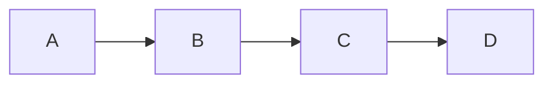

# *Markdown Structure*

## Document Structure

- The document should include at least three sections with appropriate headings
- Use a table of contents that links to each section.cd

## Text Formatting:

- Include examples of **bold**, *italics*, ~strikethrough~ text
- > Use blockquotes to highlight important points or quotes
  >
- **Demonstrate the use of inline code snippets and code blocks**
- `code`

1. ordered list item one
2. ordered list item two
3. ordered list item three

[Practice HTML](https://www.w3schools.com/html/)

---

<iframe width="560" height="315" src="https://www.youtube.com/embed/it1rTvBcfRg" frameborder="0" allowfullscreen></iframe>

This is a footnote [^1]

[^1]: footnote number 1
    
[^2]: footnote number 2
