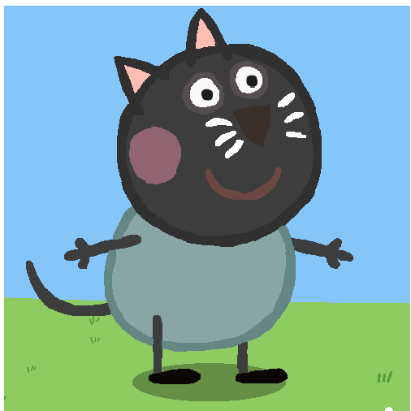

# IN CLASS EXERCISE
## Introduction
Welcome to the story of *Codey the Cat!* [Codey](https://static.wikia.nocookie.net/peppapedia/images/6/69/Cody_Cat.png/revision/latest?cb=20221030184510) is no ordinary cat-he's a tech-savvy feline who loves coding, solving problems, and exploring the digital world.



## A Day in the life of codey

### Morning Routing

Every morning, codey follows a strict routing to keep his mind sharp and his paws nimble.

1. **wake up**:codey wakes up at 7:00am sharp.
2. **Breaksfat**: a hearty blows of milk at 7:30am.
3. **coding sessions**: From 8:00am, he dives into coding.
4. ** Explore**: At 10:00am, he explores the digital garden.
5. **Lunch Break**: At 1200am, codey enjoys a well_deserved meal.

Here's what codey's daily schedule lookes like:

| **Time** |    **Actiivtiy**    |


| 7:00 AM  |    Wake up and stretch    |
| 7:30     |         Breakfast         |
| 8:00     |   Morning coding session   |
| 10:00    | Explore the digital garden |
| 12:00 PM |        Lunch break 


:   
<--- Table 
>

### Codey's Coding Challenge

One day, while exploring the digital garden, Codey encountered a locked gate. to unlock it, <br> he needed to write a special function. Codey's process was simple but effective:

- **Identify the problem**: The gate required a secret code to unlock
- **Write the Function**: Codey quickly wrte a python funsction.
- **Test the code**: He tested the code with the correct secret key.

Here's the code Codey wrote:

````
def unlock_gate(secret_code):
# The correct secret code
key = "MEOW123"
if secret_code == key:
print("Gate unlocked! Welcome to the digital garden, Codey!")
else:
print("Access denied. Try again, Codey!")
# Codey tries the code
unlock_gate("MEOW123")
```
````