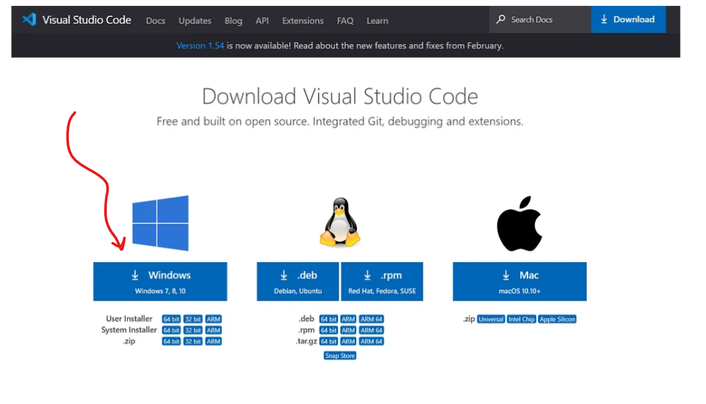
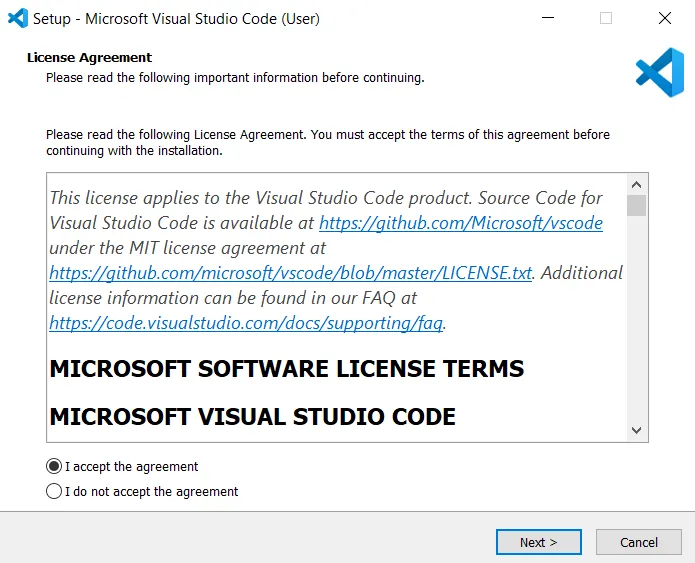
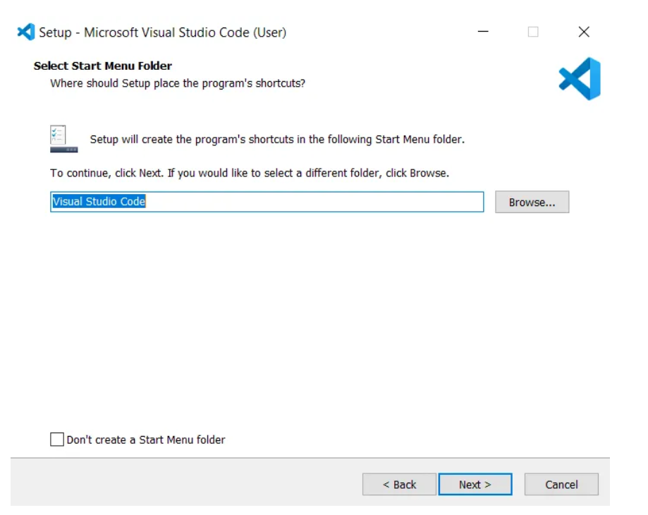
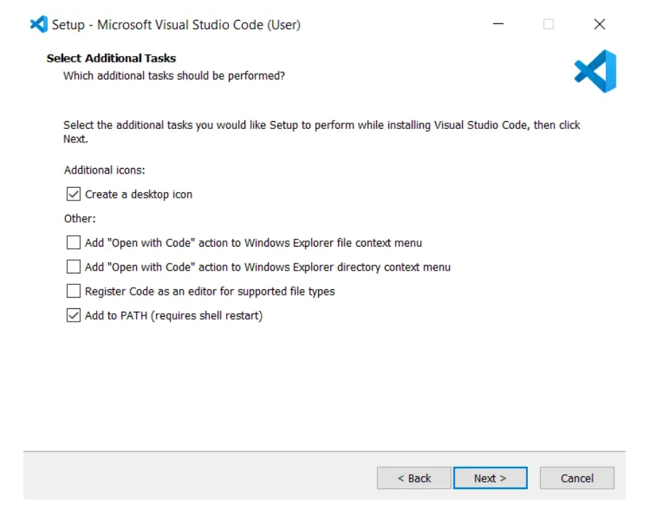
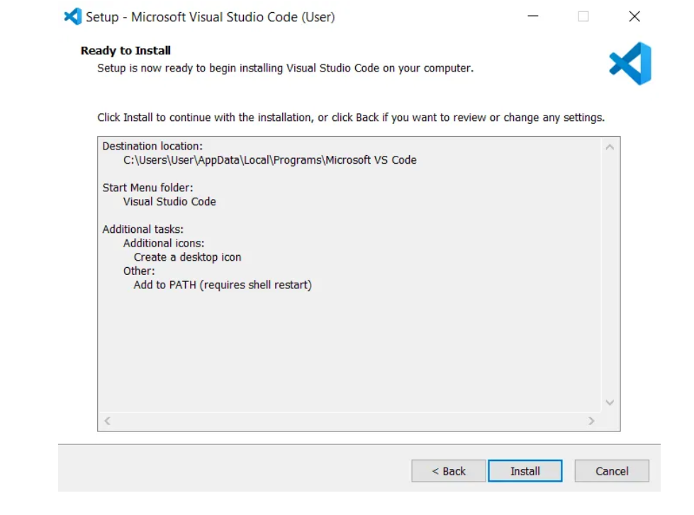
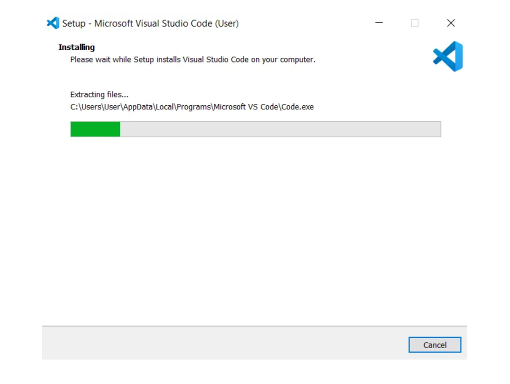
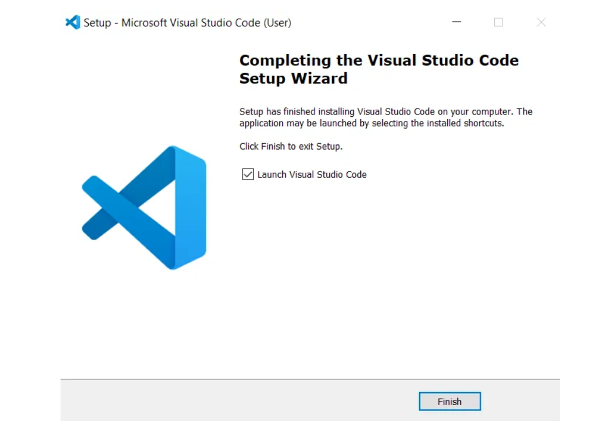
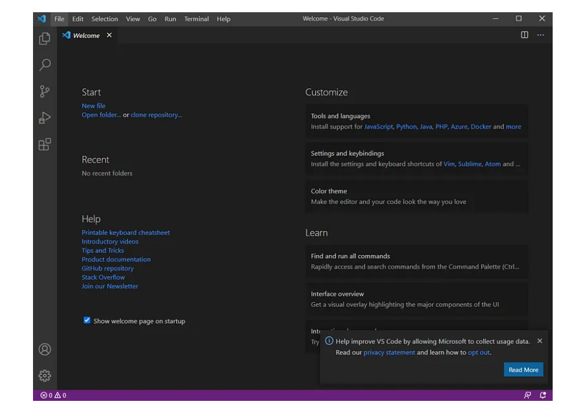

# Install Visual Studio Code
1. ### Download the executable file from the [link](https://code.visualstudio.com/download) below.

2. ### Click the option Download.
   
---

3. ### Double click the downloaded file
 Now a dialogue box appears, Select I accept the agreement Then select Next
   

---

4. ###  Select a folder by clicking Browse or just follow the default path. Then select Next.
   

---

5. ### Select the required options as per your need by clicking in the checkbox. Then select Next.

    

---

6. ### Select Install.
   

---

7. ### Wait a bit while it gets installed (The green color fills the bar).
   

---

8. ### Click Finish to exit Setup. Check in the check box to launch VS Code right now.
   

---

Congratulation! VS Code got installed in your system successfully.

Now a new dialogue box appears. This is VS Code IDE.

Click New file to open a new file.
  

  Happy Coding!