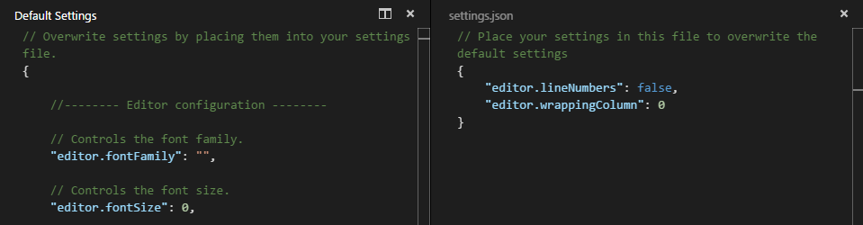

# Show .git and other default hidden folders and files in VS Code

Visual Studio Code, like many other consumer software, comes with default settings intended to safeguard users and minimize the risk of accidental mishaps.

One such setting hides certain files and directories from the file explorer view. A prominent example of this is the .git folder.

This folder holds vital Git-related data that is typically best left untouched. However, I recently needed to work with pre-commit hooks, which are handled by scripts stored in the .git/hooks folder. To modify these scripts, I wanted to access them directly within my code editor.

### How To

Using the VS Code toolbar go to ‘Code’ > ‘Preferences’ > ‘Settings’ and search for ‘exclude’ and you will find the default exclude list. Notice how this can be configured for the current user or the current workspace.


```bash
# Defaults
**/.git
**/.svn
**/.hg
**/CVS
**/.DS_Store
```
Hover over the entry you want to remove and you will be given an option to do so. Hit remove and it will be removed from the list. Notice how the list changes and you you can now see the .git dir in my repository example in the explorer on the left.


You can also follow the same logic to use this utilise this feature and add in custom exclusion of folders and files if you want!

Useful links
Microsoft Visual Studio Code Editor
https://code.visualstudio.com/